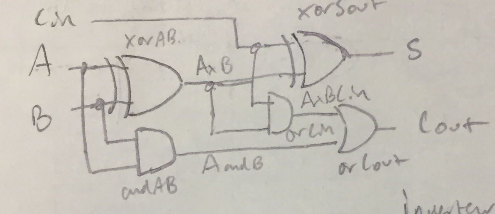
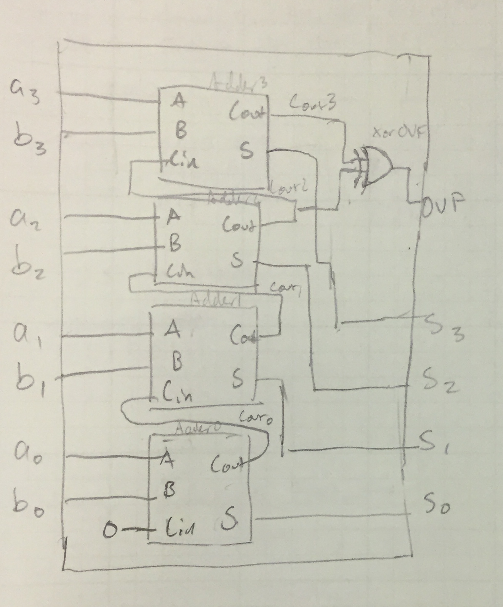
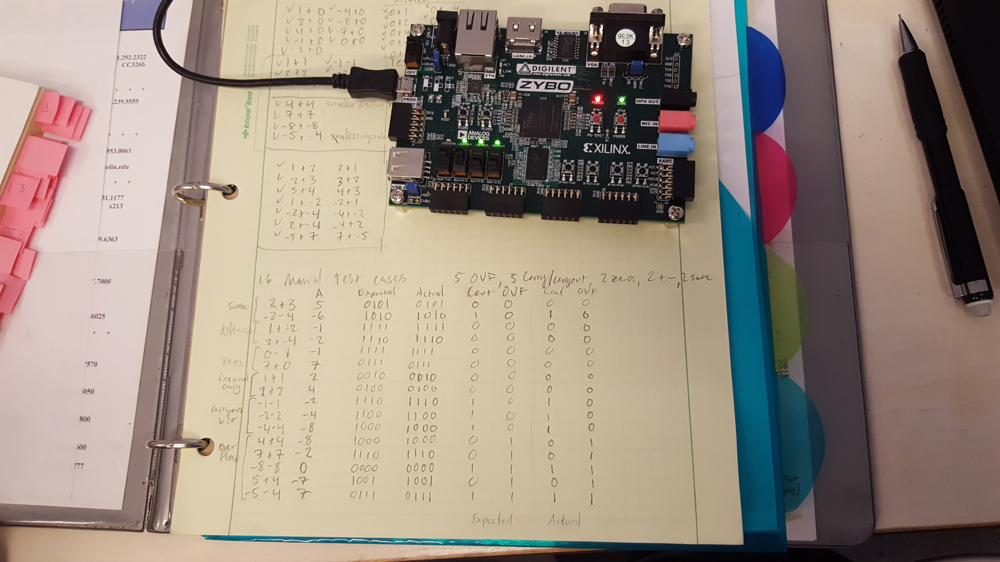
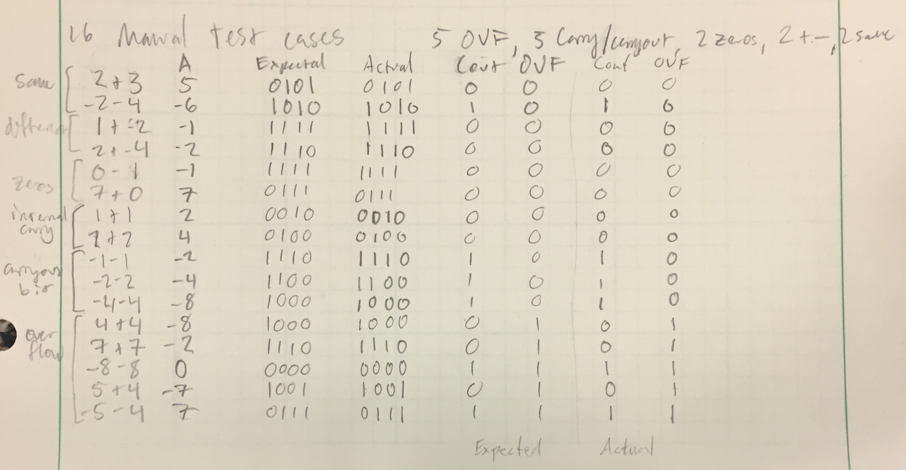
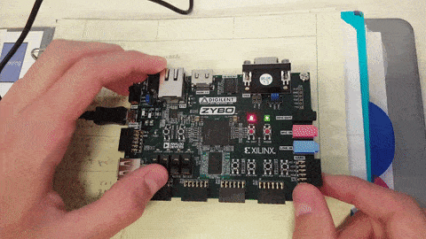

# Lab 0
### Taylor Sheneman and Alexander Hoppe

## Introduction
In this lab exercise, we used Alex's full adder implementation from HW2 to make a 4-bit adder. To do this we chained together four full adder modules, carry-out to carry-in. We then ran a simulated test bench as well as testing on a Xilinx ZYBO FPGA dev kit.


## Full Adder Behavior
Our full adder is made up of four chained-together full adder modules, each of which is was designed like the following:



Each of these full-adders has the following delay characteristics (assuming AND and XOR have the same unit gate delay, in our case 50 ns).

  | A/B | Cin
 --- | :---: | :---:
 S | 2 | 1
 Cout | 3 |  2

## Four Bit Adder

To make a 4 bit adder, these modules are then chained together as in the following diagram:



When chained together, they have the following delay characteristics (in gate delay units):

 | Cin | A/B0 | A/B1 | A/B2 | A/B3 |
---|:---:|:---:|:---:|:---:|:---:
S0 | 1 | 2 | X | X | X
C0 | 2 | 3 | X | X | X
S1 | 3 | 4 | 2 | X | X
C1 | 4 | 5 | 3 | X | X
S2 | 5 | 6 | 4 | 2 | X
C2 | 6 | 7 | 5 | 3 | X
S3 | 7 | 8 | 6 | 4 | 2
Cout | 8 | 9 | 7 | 5 | 3
OVF | 9 | 10 | 8 | 6 | 4

So, the worst case here is that the overflow bit takes 10 unit gate delays to stabilize if it's affected by the least significant bits of the operands.

## Timing Waveforms

The operation that we used to show the worst-case delay (passing through all of the carry-outs from the LSB of each operand) was -1 + 1, which renders as `F` + `1` in GTKWave (`b1111` + `b0001`).


This is the waveform for our entire test bench.


This is the worst case gate delay we simulated. Visible is the overflow stabilizing at the very end of the propagation chain.

## Test Bench
In writing our test bench, we decided to cover a few different types of adder case. These were as follows:

```
Test Case       |  A   |  B   | Expected Actual | Cout OVF

Zero Cases
1+0  (0001+0000)| 0001 | 0000 |  0001     0001  |  0    0
2+0  (0010+0000)| 0010 | 0000 |  0010     0010  |  0    0
4+0  (0100+0000)| 0100 | 0000 |  0100     0100  |  0    0
-1+0 (1111+0000)| 1111 | 0000 |  1111     1111  |  0    0
-2+0 (1110+0000)| 1110 | 0000 |  1110     1110  |  0    0
-4+0 (1100+0000)| 1100 | 0000 |  1100     1100  |  0    0
-2+0 (1000+0000)| 1000 | 0000 |  1000     1000  |  0    0
 7+0 (0111+0000)| 0111 | 0000 |  0111     0111  |  0    0
 0+0 (0000+0000)| 0000 | 0000 |  0000     0000  |  0    0

Mirrored Zero Cases
 0+1 (0000+0001)| 0000 | 0001 |  0001     0001  |  0    0
 0+2 (0000+0010)| 0000 | 0010 |  0010     0010  |  0    0
 0+4 (0000+0100)| 0000 | 0100 |  0100     0100  |  0    0
 0+7 (0000+0111)| 0000 | 0111 |  0111     0111  |  0    0
0+-1 (0000+1111)| 0000 | 1111 |  1111     1111  |  0    0
0+-2 (0000+1110)| 0000 | 1110 |  1110     1110  |  0    0
0+-4 (0000+1100)| 0000 | 1100 |  1100     1100  |  0    0
0+-8 (0000+1000)| 0000 | 1000 |  1000     1000  |  0    0
```

First, we covered cases in which one input is zero and the other non-zero, to verify that each bit of each input is working and being passed through correctly to output.

```
Testing Internal Carryouts
 1+1 (0001+0001)| 0001 | 0001 |  0010     0010  |  0    0
 2+2 (0010+0010)| 0010 | 0010 |  0100     0100  |  0    0

Testing External Carryout
-1-1 (1111+1111)| 1111 | 1111 |  1110     1110  |  1    0
-2-2 (1110+1110)| 1110 | 1110 |  1100     1100  |  1    0
-4-4 (1100+1100)| 1100 | 1100 |  1000     1000  |  1    0
```

We wrote cases to test the functionality of the internal and external carryout wires on a mostly-individual basis (there's no 4+4 case, but that carryout should be covered by the -4-4 case).

```
Test Overflows
4+4  (0100+0100)| 0100 | 0100 |  1000     1000  |  0    1
7+7  (0111+0111)| 0111 | 0111 |  1110     1110  |  0    1
-8-8 (1000+1000)| 1000 | 1000 |  0000     0000  |  1    1
 5+4 (0101+0100)| 0101 | 0100 |  1001     1001  |  0    1
-5-4 (1011+1100)| 1011 | 1100 |  0111     0111  |  1    1
```

To test our OVF bit, we wrote a few cases that intentionally overflow, in both the positive and negative direction.

```
Regular Cases
1+2  (0001+0010)| 0001 | 0010 |  0011     0011  |  0    0
2+3  (0010+0011)| 0010 | 0011 |  0101     0101  |  0    0
3+4  (0011+0100)| 0011 | 0100 |  0111     0111  |  0    0
1+-2 (0001+1110)| 0001 | 1110 |  1111     1111  |  0    0
-2-4 (1110+1100)| 1110 | 1100 |  1010     1010  |  1    0
2+-4 (0010+1100)| 0010 | 1100 |  1110     1110  |  0    0
-5+7 (1011+0111)| 1011 | 0111 |  0010     0010  |  1    0
```

We rounded out the tests with a selection of regular, non-overflow cases, including additions of positive and negative numbers that result in a sign-flip.

```
Worst Case Delay
-1+1 (1111+0001)| 1111 | 0001 |  0000     0000  |  1    0
```
Finally, we attempted to test the worst case delay, by doing a calculation that results in the first bit carryout propogating all the way to the final carryout bit.

## Test Case Failures
While it seems unlikely, the only two failures we encountered during our test bench simulation were due to typos in our test bench display lines. Two plus three is five, not six.

## Implementation on FPGA


After we were convinced that our 4-bit adder code worked, we synthesized it and implemented it on our FPGA dev kit. We selected the following test cases for our manual testing, which we compared against our test bench results to ensure that it was behaving properly.



We selected some cases where the sign was the same and different, where there were zeros, where there were internal carries, where there were carryout bits, and where there were overflows.



Our FPGA behaved spectacularly!

## Synthesis Statistics


After our design was synthesized, it ended up using 8 look-up tables, 9 flipflops, 13 IO devices and 1 `BUFG`, which we found out was a global clock buffer.

The IO numbers correspond to the twelve devices we instatiated (four buttons, four switches, and four LEDs on ouput pins), and apparently one extra, which we think might have come from the USB connection or a status LED, we're not sure. The LUTs are not surprising, as we saw that a half-adder can be implemented with a single LUT, and therefore 4 full adders would require 8. We conjecture that the 9 flipflops would be accounted for by the 8 inputs, `a[3..0]` and `b[3..0]`, and the final one might be the `0` input to the first full adder's carry-in.
