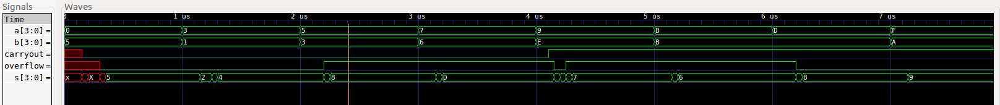
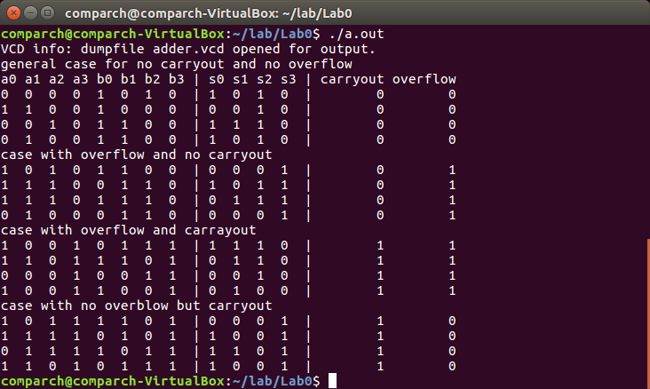
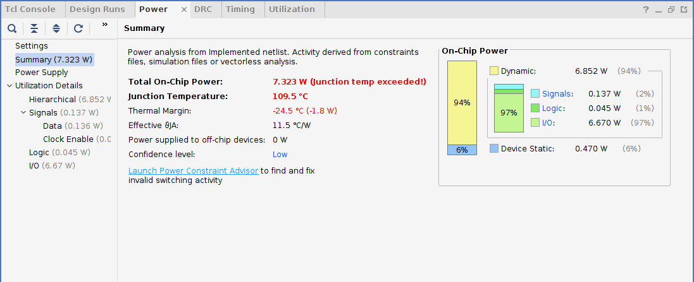

# Lab 0 Report

### Changjun Lim, Sungwoo Park

### Waveform

Above figure shows the waveform of our adder going through few test cases. Notice that even though there are some glitches right after the inputs change, the sum output value stabilizes shortly after. 

It seems like the worst delay occurs when the all bits of two input values changes, which results in change in individual sum bits and intermediate carry-in values between the adders.

##### Test case
 We chose the following 16 test cases among the total 256 test cases. There are two interesting situations that are involved in this operation, namely overflow and carryout. We wanted to comprehensively test each possible scenario involving overflow and carryout. In order to do this, we grouped the test cases into 4 scenarios(whether there is an overflow or a carryout). We selected 4 test cases for each scenario.

 The test case 1-4 show the cases with no sum and carryout. The test case 5-8 are for the cases with overflow but no carryout. The test case 9-12 have only overflow and the test case 13-16 have both carryout and overflow. 

Note: Least significant binary digit has an index 0 in the variables.

(a: a[3],a[2],a[1],a[0],    b: b[3],b[2],b[1],b[0],  s: s[3],s[2],s[1],s[0])

    Input value    /  Expected result
1. a=0000, b=0101  /  sum=0101  carryout=0  overflow=0
2. a=0011, b=0001  /  sum=0100  carryout=0  overflow=0
3. a=0100, b=0011  /  sum=0111  carryout=0  overflow=0
4. a=0010, b=0011  /  sum=0101  carryout=0  overflow=0
5. a=0101, b=0011  /  sum=1000  carryout=0  overflow=1
6. a=0111, b=0110  /  sum=1101  carryout=0  overflow=1
7. a=0111, b=0111  /  sum=1110  carryout=0  overflow=1
8. a=0010, b=0110  /  sum=1000  carryout=0  overflow=1
9. a=1001, b=1110  /  sum=0111  carryout=1  overflow=1
10. a=1011, b=1011 /  sum=0110  carryout=1  overflow=1
11. a=1000, b=1100 /  sum=0100  carryout=1  overflow=1
12. a=1001, b=1001 /  sum=0010  carryout=1  overflow=1
13. a=1101, b=1011 /  sum=1000  carryout=1  overflow=0
14. a=1111, b=1010 /  sum=1001  carryout=1  overflow=0
15. a=1110, b=1101 /  sum=1011  carryout=1  overflow=0
16. a=1011, b=1110 /  sum=1001  carryout=1  overflow=0

### Result of test bench output

### Failed test cases

Our code passed all our initial test cases.

### Test Result on FPGA

Following pictures are the documentation of our testing process for case 9 (1001 + 1110) using FPGA board.

A input

B input

Sum output

Carryout/overflow output

The summary statistics from Vivado.
Power

Timing

Uitilization
